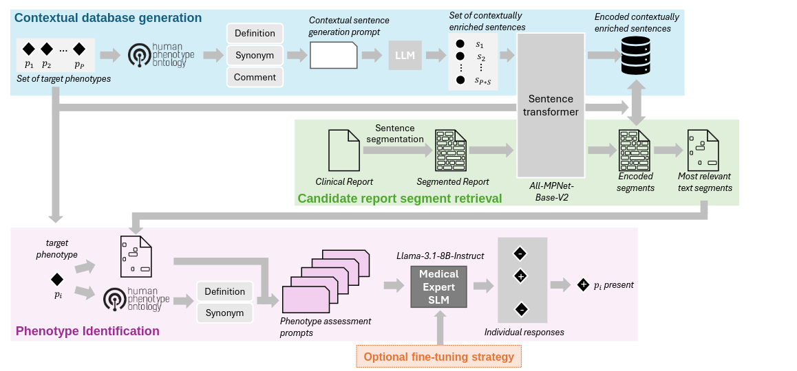
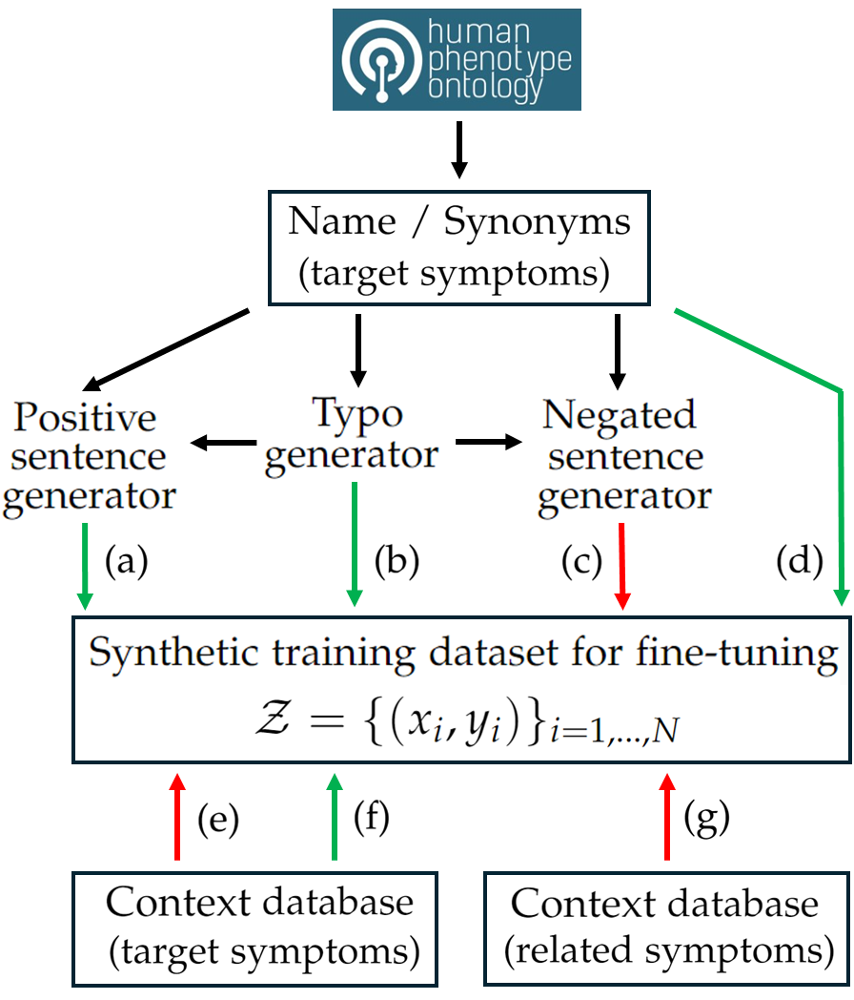

# PhenoRAG

## Retrieval-Augmented Generation<br>for Efficient Zero-Shot Clinical Phenotype Identification



## How to install PhenoRAG 

- Download Language Model ([Llama-3.1-8B-Instruct](https://huggingface.co/meta-llama/Llama-3.1-8B-Instruct))
- Download Sentence Transformer ([All-MPNet-Base-V2](https://huggingface.co/sentence-transformers/all-mpnet-base-v2))
- Clone the PhenoRAG repo
```bash
git clone git@github.com:marcb1893/PhenoRAG.git
```
- Create and activate conda environment
```bash
conda env create -f environment.yaml
conda activate PhenoRAG_env
```
- Download the necessary NLP resources:
```bash
python setup.py
```


## How to use PhenoRAG

### Inference
1. **Configure parameters:**
   Edit the `config.yaml` file to specify all required paths and options.
   Essential fields include:
   - `llama_dir_base`: Path to the base Llama model directory
   - `sent_transformer_dir`: Path to the sentence transformer model directory
   - `context_dir`: Directory containing context data (e.g., `/resources/context_data/context_HCY` or `resources/context_data/context_UTI`)
   - `stanza_dir`: Directory with Stanza resources
   - `input_dir`: Directory containing input text files (or specify `UTI` if processing translated UTI reports)
   - `output_dir`: Directory where results will be saved

   Optional:
   - `llama_dir_ft`: Path to a fine-tuned Llama model (if you want to use fine-tuned weights)

2. **Run inference:**
   Execute the inference script to generate predictions:
   ```bash
   python inference.py --config config.yaml
   ```

### Fine-tuning
To fine-tune the Llama model with symptom context data, run the `fine_tune.py` script with the required arguments:

```bash
python fine_tune.py --llama_dir <path_to_base_llm> \
                    --context_dict_path <path_to_context_pickle> \
                    --target_symptoms_path <path_to_target_symptoms_csv> \
                    --output_dir <path_to_save_finetuned_model>
```
*Note:* `context_dict` and `target_symptoms` files are included in this repository under:

    context_dict_path: /resources/context_data/context_fineTune/ft_context_dict.pkl
    target_symptoms_path: /resources/data/UTI/target_symptoms.csv
    
The data generation process for the fine-tuning procedure is illustrated below: 

<p align="center">
  
</p>

Arrows indicate the flow of information, while their colours represent the
ingestion of positive (green) and negative (red) examples into the training dataset.

More details can be found in the paper. 

### Evaluation
To evaluate the model's performance, use the provided evaluation scripts to compare its responses against the ground truth data.

Example command to run eval_synRep.py for analyzing the output after processing the synthetic reports:

```bash
python eval_synRep.py --responses_dir <path_to_responses> \
                      --fine_tuned <True|False> \
                      --output_dir <path_to_save_results> \
                      --target_symptoms_path <path_to_target_symptoms_csv> \
                      --ground_truth_path <path_to_ground_truth_csv>
```
*Note:*`target_symptoms` and `ground_truth` files are included in this repository under:

    target_symptoms_path: /resources/data/synthetic_reports/target_symptoms.csv
    ground_truth_path: /resources/data/synthetic_reports/ground_truth.csv


